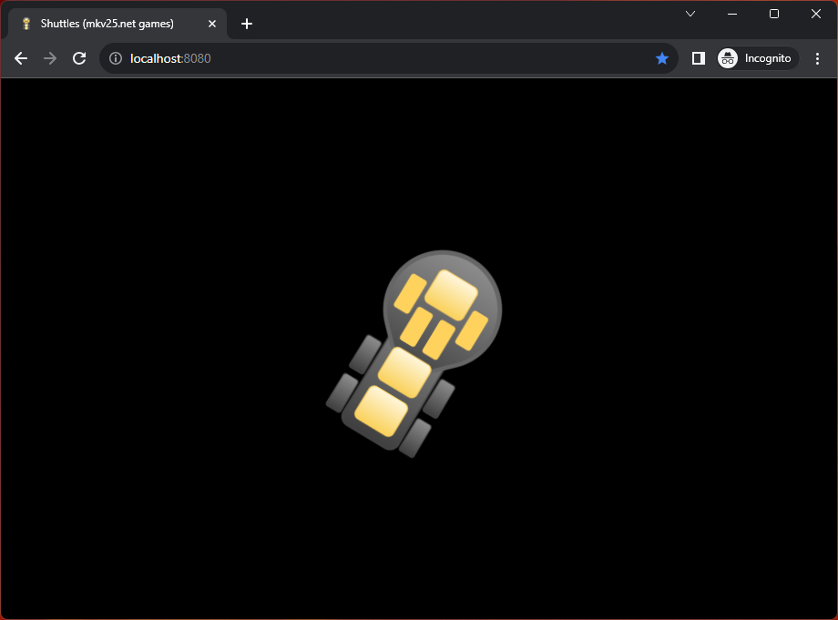

# Shuttles

This is a demo project combining Vue + Vite, and Pixi.js using a TypeScript setup.

Preview:
- https://mkv25-games.github.io/shuttles/

## Local Development

Requires Node.js LTS (20.x or later)

- `npm install` to install dependencies
- `npm run dev` to start the dev server
- `npm run lint` to identify and fix any common linting errors
- `npm run build` to build for production
- `npm run preview` to preview the production build
